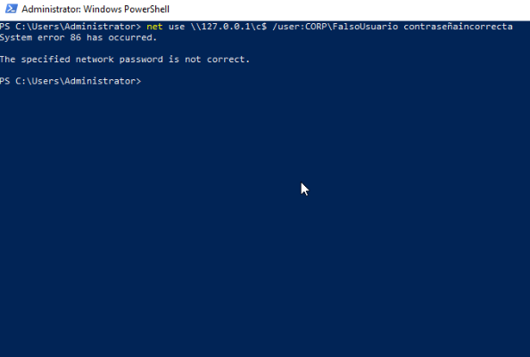
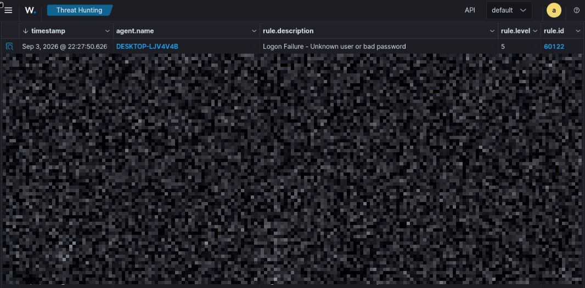
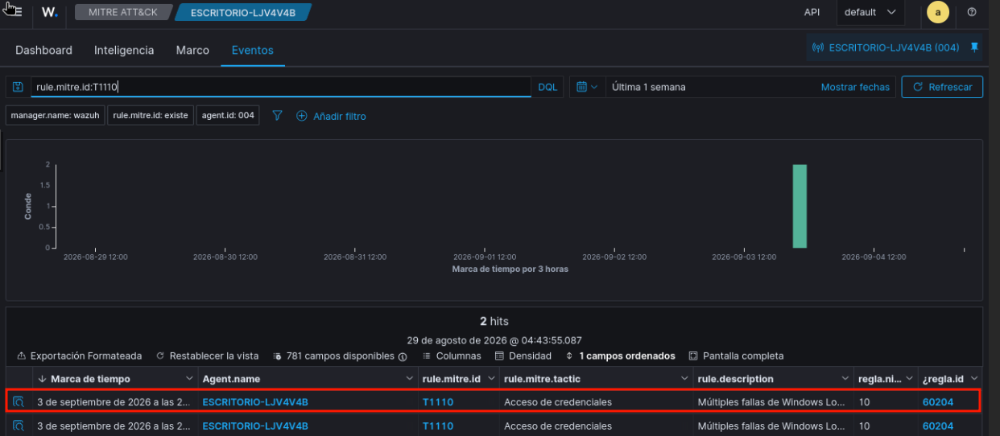
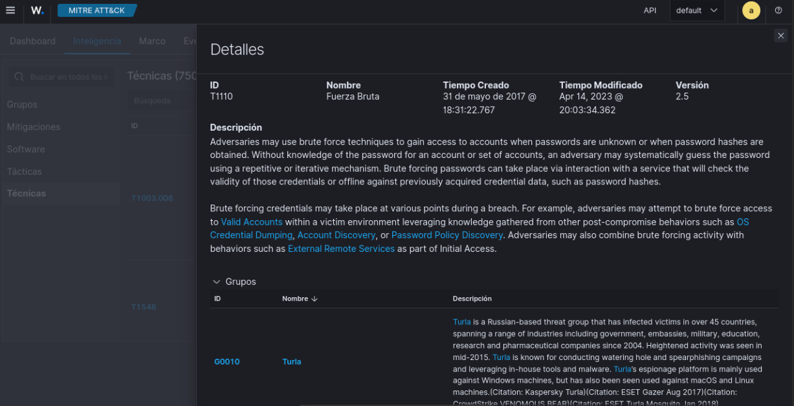

## Simulación de Fuerza Bruta - Credenciales Inválidas sobre SMB (MITRE T1110)

### 1. Resumen Ejecutivo
Se simuló un intento de autenticación fallida contra un usuario inexistente
en el dominio (`CORP\FalsoUsuario`) desde el host `DESKTOP-LJV4V4B` (agente
004), usando el protocolo SMB. El evento individual fue capturado por Wazuh
bajo la regla 60122, pero el hallazgo relevante surgió al identificar que
Wazuh cuenta con una regla de correlación (60204) que agrupa múltiples fallos
de logon y aplica un mapeo MITRE más preciso.

### 2. Evidencia — Generación del Evento

Comando ejecutado en PowerShell contra el recurso SMB local, con credenciales
inválidas para un usuario inexistente en el dominio. Windows devuelve el
System error 86 (contraseña de red incorrecta).

### 3. Evidencia — Detección Individual en Wazuh

Evento individual capturado: regla `60122`, nivel 5, agente `DESKTOP-LJV4V4B`.

### 4. Análisis del Mapeo MITRE — Primer hallazgo

El evento individual (regla 60122) aparece mapeado por Wazuh a **T1531
(Account Access Removal, táctica Impact)**. Al revisar la definición oficial
de MITRE, esta técnica describe la eliminación o bloqueo de cuentas legítimas
— no corresponde al comportamiento observado (un intento fallido de
autenticación). Este es un ejemplo real de por qué un analista no debe tomar
el mapeo automático de un SIEM como verdad absoluta sin validarlo contra la
definición técnica de la táctica/técnica.

### 5. Evidencia — Detección de Correlación (Mapeo Correcto)

Al buscar `rule.mitre.id:T1110` en Threat Hunting, se identificó la regla
`60204` ("Múltiples fallas de Windows Logon"), nivel **10**, correctamente
mapeada a **T1110 (Brute Force, táctica Credential Access)**. Esta regla se
dispara quando se agregan múltiples eventos de fallo de logon en una ventana
de tiempo, y es la que realmente representa un patrón de fuerza bruta.

### 6. Mapeo MITRE ATT&CK® — Conclusión
| Evento | Regla | Nivel | Mapeo Wazuh | Mapeo Correcto (validado manualmente) |
|---|---|---|---|---|
| Fallo individual | 60122 | 5 | T1531 (impreciso) | Sin categorizar como técnica aislada |
| Múltiples fallos | 60204 | 10 | T1110 (correcto) | T1110.001 — Brute Force: Password Guessing |

### 7. Procedimiento de Respuesta (Playbook de Triage)
1. Ante un evento aislado (regla 60122), no escalar de inmediato — validar
   si el usuario objetivo existe realmente en el AD (`Get-ADUser`).
2. Verificar si el mismo host/usuario generó múltiples fallos en una ventana
   corta (regla 60204 como indicador de correlación real).
3. Confirmar el origen: IP loopback (127.0.0.1) indica ejecución local en el
   propio host, no un ataque remoto — cambia la prioridad de respuesta.
4. Si se confirma patrón de fuerza bruta real (regla 60204 activa, origen
   remoto, múltiples usuarios o intentos): bloquear la cuenta/IP origen,
   notificar a N2, documentar como incidente.
5. **Acción tomada en este caso:** evento controlado y simulado para fines de
   validación del pipeline de detección; no se ejecutó contención real. En un
   escenario productivo, se habría escalado según el punto 4 al confirmarse
   la regla 60204.
