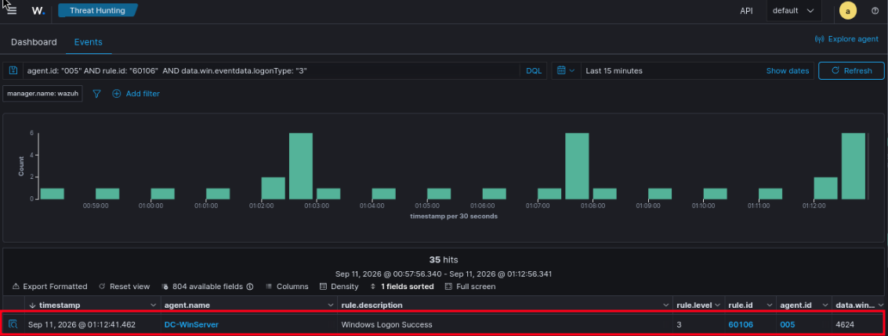

# Incident Report 02: Movimiento Lateral vía Creación de Servicios (T1543.003 / T1021.002)

## 1. Resumen Ejecutivo
Se ejecutó una técnica de movimiento lateral desde el endpoint `VM108` hacia el Controlador de Dominio `VM109`. El ataque utilizó privilegios elevados del agente para autenticarse remotamente y crear un servicio en el DC, consolidando acceso sin necesidad de extraer credenciales previamente.

---

## 2. Telemetría y Evidencia
* **Host Origen:** VM108 (Client - 10.10.20.51)
* **Host Destino:** VM109 (DC - 10.10.20.10 - Agent ID: 005)
* **Eventos Clave:**
  * Rule `60106` (Windows Logon Success) - Event ID 4624
* **Indicador de Compromiso (IoC):** Logon Type `3` (Network Logon) originado desde la IP de la VM108 hacia el DC.

---

## 3. Mapeo MITRE ATT&CK®

| Táctica | Técnica | ID |
| :--- | :--- | :--- |
| **Lateral Movement** | Remote Services: SMB/Windows Admin Shares | `T1021.002` |
| **Privilege Escalation / Persistence** | Create or Modify System Process: Windows Service | `T1543.003` |

---

## 4. Análisis de Brecha (Gap Analysis)
Se identificó una brecha de detección (Gap). El inicio de sesión remoto (Logon Type 3) generó el evento `60106` con `level 3`. Al estar por debajo del umbral de alerta (level 5+), el SOC no recibiría una notificación activa sobre este movimiento lateral hacia un activo crítico (Domain Controller).

---

### Evidencia de Movimiento Lateral (Wazuh)

---

---

## 5. Triage
* **Severidad (S):** S1 (Level 3 - Bajo)
* **Criticidad (C):** C3 (Activo Crítico - Domain Controller)
* **Confianza (F):** F2 (Corroborado por Wazuh y logs de operación de CALDERA)
* **Prioridad Final:** **P3** (S1 + C3 + F2). 
* *Justificación:* Aunque la criticidad del activo es alta y la detección está confirmada, la severidad técnica nativa de la regla no alcanza el umbral para escalar automáticamente. Se requiere la creación de una regla local que eleve la severidad al detectar Logon Type 3 hacia el DC desde endpoints de usuarios.
